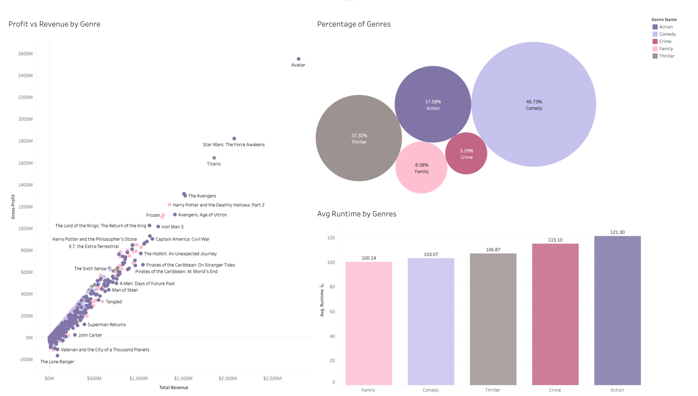
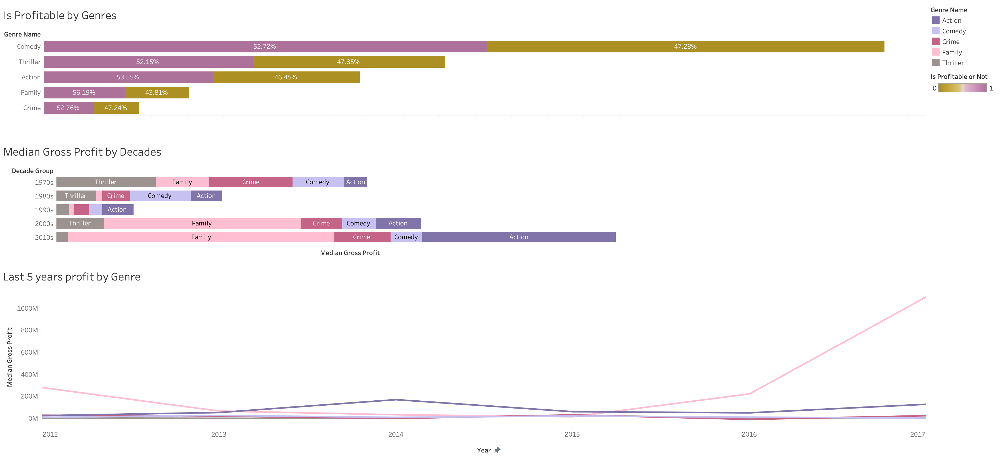
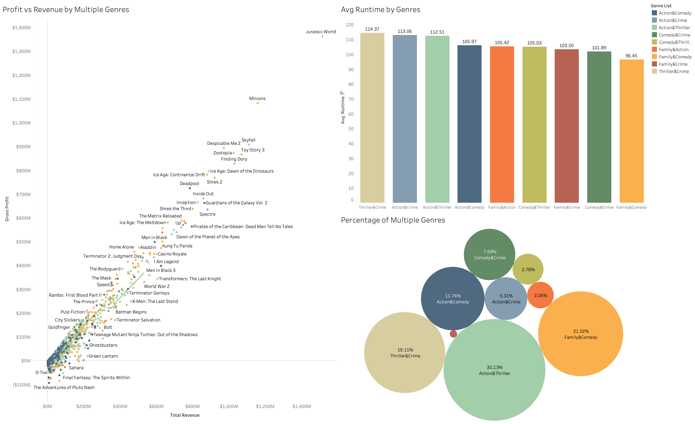
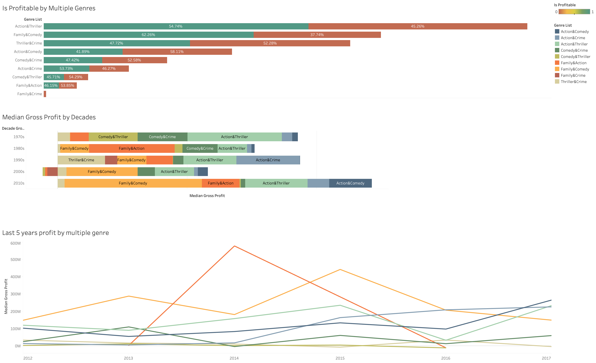

Family and Action are the most profitable genres. However, the Family & Action genre group doesn’t have stability. The profit/revenue numbers changed in a different year range. Based on the above result, Family is the recommended genre. 
Following exploratory analysis and their conclusions reveal the final recommendation.
The below dashboard shows general information such as percentage of genres, avg runtime by genres. 

https://public.tableau.com/profile/dturgut#!/vizhome/Single_Genre_EDA/Single_genre_story

In the single genre table, 
*	Revenue and gross profit have a linear relationship. 
*	47% of movies’ genres are comedies. However, most 10 profitable movies’ genres belong to Action and Family. 
*	Total revenue vs Gross Profit scatterplot shows that ‘Avatar’ is the highest revenue movie in this data. This movie’s genre is Action & Adventure & Fantasy & Science Fiction. But in that graph, only show Action as its genre since `action` is into the 5 genres group. 
*	According to the `Is Profitable or Not` horizontal bar graph, all genres’ profitable ratio is more than 50%. Family is in the first place with the highest rate and Action is in second place with the second-highest rate. 
*	In the last 2 decades, the family genre has the highest median gross profit. On the other hand, Action has the second-highest median gross profit in the 2010s. 
*	The last graph shows the last five years of Median Gross Profit by genre. According to this line graph, the family has the highest number in most years. Only in 2014, it lost its first place to the Action genre. Also, in 2016 and 2017, the Family genre has a great difference from other genres. 
*	There is an additional $5,000,000 cost that can be anticipated. According to the last 5 years profit, Crime, Comedy and Thriller genres have less than $5,000,000 profits in some years. 

Based on this graph Family and Action genres are the highest profitable genres overall. However, to be able to decide one genre, multiple genres table results should be interpreted too.

---------------------
Second analysis made for multiple genres. According to the below graph, more than 50% of multiple genres have only two genres. So, this steps analysis done for double genres.

First dashboard shows details about the multiple genres of movies. The first dashboard shows information about the percentage of multiple genres, avg runtime.

Second dashboard shows information such as revenue, profit, and profitability for each genre set.

https://public.tableau.com/profile/dturgut#!/vizhome/Multiple_Genres_EDA/Multiple_genre_story

In the multiple genres table,

*	The highest number of genre groups is `Action & Thriller` with a 30% ratio. The second highest number of groups is `Family & Comedy` with a 21% ratio. 
*	The highest profit movie belongs to the Action & Thriller group. On the other hand, most of the top 10 highest profit movies’ genres belong to the Family & Comedy group. 
*	Based on the ‘Is Profitable or Not’ graph, Family & Comedy has the highest profitable ratio with 62.6% and the second-highest ratio belongs to the ‘Action & Thriller’ group with 54.7%
*	Family & Comedy group has the highest profit in the last 2 decades. In the 2010s, this group was almost 3x times higher than the second-highest group. In the 80s Family & Action had the highest profit than other genres and this group had a loss in the 2000s. On the other hand, according to the last 5 years line graph, this genre group has the highest profit in 2014. 
*	Family & Comedy group had a high profit in the last 5 years and in most years this group is in the first place. 
