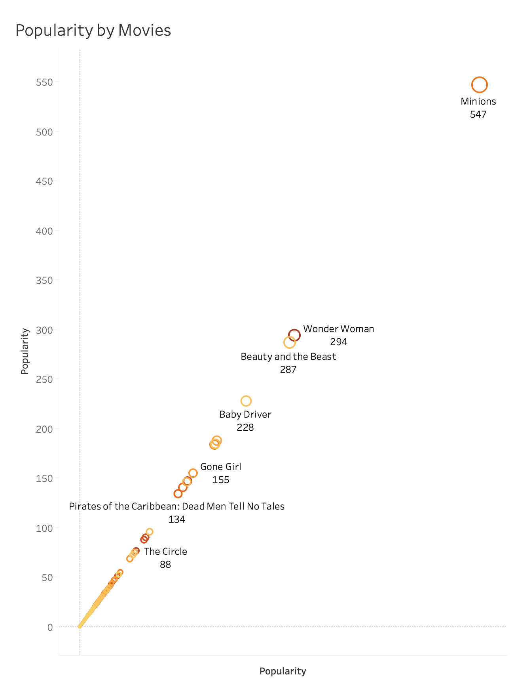
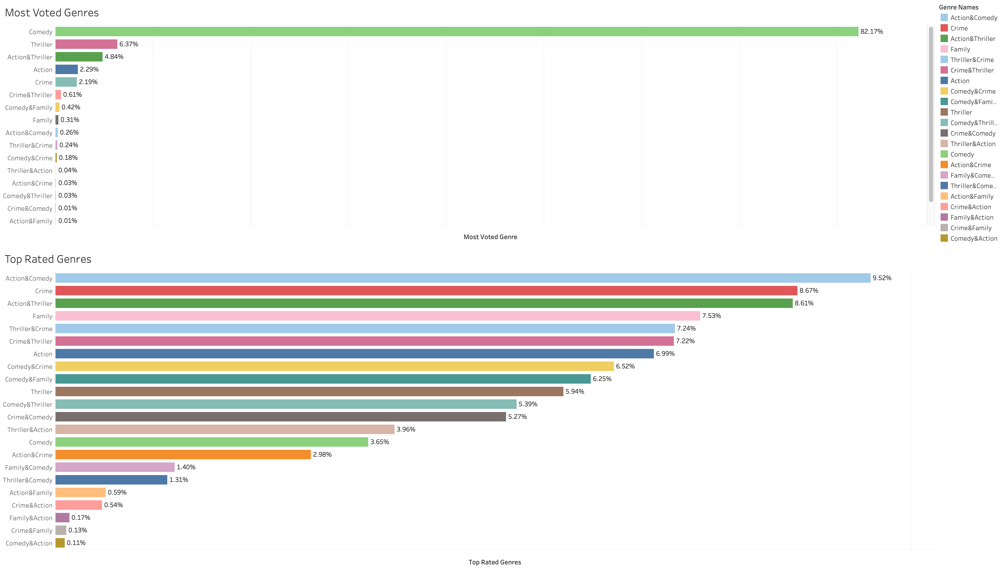
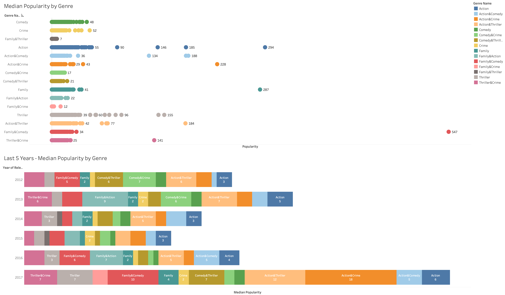

I recommend Action to the team based on customer engagement analysis.

Following exploratory analysis and their conclusions reveal the final recommendation.
In this part, instead of revenue and budget features, other features that related with long term customer engagement have been analyzed. Most analysis done by rating dataset.
Other analysis besides rating, done by `popularity` feature from the metadata dataset. Based on the below graph, popularity numbers are similar for most movies. There are some movies that could be an outliers.

First dashboard shows details about genres that are most voted by users and genres that are most rated by users. 

https://public.tableau.com/profile/dturgut#!/vizhome/Rated_and_Voted_Genres_Dashboard/Dashboard8

Second dashboard shows information about popularity and product companies for 5 genres that are being considered.

https://public.tableau.com/profile/dturgut#!/vizhome/Popularity_Dashboard/popularity-productiondashboard2

Conclusions
*	Comedy is the most voted genre by users however this genre didn’t have the highest rating.
*	The `Action & Comedy` genre has the highest rating. Also, the number of second and third highest genres are very close. 
*	According to the last five years graph (2012-2017), in the year of 2017 Action genre and its some group combinations have the highest popularity from other genres. Also in general `Action`, `Thriller` and `Action & Thriller` have the highest popularity from other genres. 

